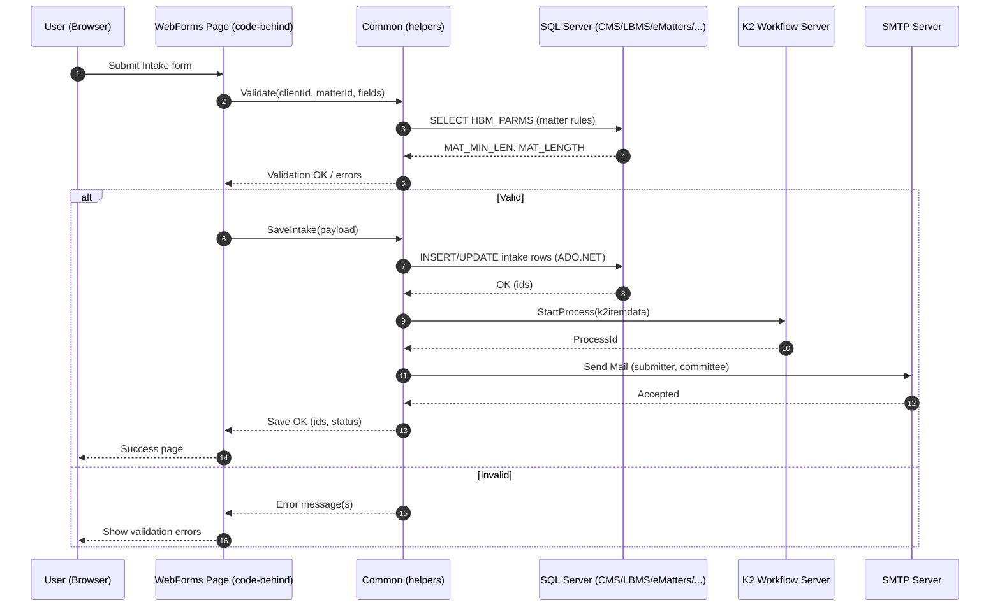

# NBI Intake – Design Document

**Source analyzed:** `/mnt/data/nbicode.cs` (namespace `KDWNMIntakeWeb`; classes: `Common`, `k2itemdata`; ~11.9k LOC).

## 1) Context & Goals

This codebase implements a New Business Intake (NBI) / matter‑opening toolkit for an ASP.NET WebForms application. It validates client & matter identifiers, persists intake data to multiple SQL Server backends, kicks off workflow in K2, and issues email notifications. There are also utilities for searching/adding parties and miscellaneous helper routines.

**Primary goals:**

* Capture/validate intake data (client, matter, employees, fees, compliance flags).
* Persist to operational systems (CMS, LBMS, eMatters, etc.).
* Orchestrate approvals via K2 workflow.
* Notify stakeholders via SMTP email.

## 2) High‑Level Architecture

```mermaid
flowchart LR
  A[User Browser]\n(ASP.NET WebForms pages) --> B[Code-behind / Business helpers\n`Common`, `k2itemdata`]
  B --> C[(SQL Server DBs)\nCMSOPEN / LBMS / eMatters / up / eskort_kdw / sp19]
  B --> D[K2 Workflow Server]
  B --> E[SMTP Server]
  B --> F[Filesystem IO]
  B --> G[ConfigurationManager\nAppSettings + ConnectionStrings]
```

### Key Components

* **Web UI (WebForms):** Pages and controls (code-behind not included here) call helper methods in `Common`.
* **Business Helpers (**``**):** Large static utility surface: validation, CRUD using ADO.NET, search logs, party management, notification composition/sending, and K2 hand-offs.
* **Workflow (**``**):** Data structure(s) for K2 payloads; interaction helpers tying intake records to workflow instances.
* **Data Access:** Raw ADO.NET (`SqlConnection`, `SqlCommand`, `SqlDataAdapter`), a mixture of inline SQL and stored procedures.
* **Notifications:** `System.Net.Mail` constructs `MailMessage` and uses `SmtpClient(smtpserver, port)` to deliver.

## 3) Domain Concepts (inferred)

* **Client / Matter:** IDs validated against parameter rules (e.g., `HBM_PARMS` for matter length/minimum). Numeric/length checks and existence checks.
* **Employee / Requestor:** Lookups to get employee code from login and office.
* **Parties:** Functions to add/update/delete parties tied to a search/intake id.
* **Intake Record:** Field‑heavy object persisted across databases; includes fee arrangements and billing guideline flags.

## 4) Key Workflows

### 4.1 Intake Submission & Approval

1. **User submits** intake form in WebForms page.
2. **Validation** in `Common` (`isAssignedMatterValid`, numeric/length checks via parameters from DB).
3. **Persistence** to SQL (insert/update across target DBs; sometimes stored procedure calls).
4. **Workflow kick‑off**: build `k2itemdata`, start K2 process for approvals.
5. **Notifications**: send confirmation and/or rejection emails to submitter/committees.
6. **Auxiliary updates**: party list, search logs, and reopen logic if applicable.

### 4.2 Reopen / Reject

* Functions create a search log entry (`generateSearchLog`), update record state, send a templated email explaining reason.

## 5) Detailed Sequence (Happy Path: New Intake)



## 6) Integrations & Specifications

This section lists the external systems the code interacts with and the expected configuration shape.

### 6.1 Databases (SQL Server via ADO.NET)

* **Providers:** `System.Data.SqlClient` (`SqlConnection`, `SqlCommand`, `SqlDataAdapter`).
* **ConnectionStrings** (from `web.config`/`app.config`):

  * `CMSOPENConnectionString`
  * `LBMSConnectionString`
  * `eMattersConnectionString`
  * `eskort_kdwConnectionString`
  * `upConnectionString`
  * `sp19ConnectionString` (a SQL database labeled *sp19*; used for updates/selects in this codebase).
* **Patterns:**

  * `using (SqlConnection conn = new SqlConnection(ConfigurationManager.ConnectionStrings["<name>"].ConnectionString))`
  * Inline SQL for parameter rules (e.g., `SELECT MAT_MIN_LEN, MAT_LENGTH FROM HBM_PARMS`).
  * Occasional stored procedure calls (`CommandType.StoredProcedure`).
  * Parameters added via `SqlCommand.Parameters.AddWithValue("@Param", value)`.
* **Operational guidelines:**

  * Ensure **least‑privilege** SQL logins; segregate write vs read if possible.
  * Centralize command timeouts; avoid concatenating user input (some strings appear concatenated—sanitize rigorously or use parameters).
  * Wrap multi‑table saves in transactions.

### 6.2 Workflow – K2

* **Purpose:** Start/advance approval workflows for intake records.
* **Config (AppSettings):** `k2server`, `k2user`, `k2pwd`.
* **Data contract:** `k2itemdata` packs form identifiers/metadata for the process instance.
* **Operational guidelines:** Secure the K2 service account; use encrypted secrets.

### 6.3 Notifications – SMTP Email

* **API:** `System.Net.Mail` (`MailMessage`, `SmtpClient`).
* **Runtime:** `new SmtpClient(smtpserver, port)`; bodies are HTML (`IsBodyHtml = true`).
* **Recipients:** Dynamic (submitter, committee lists); several AppSettings hold role‑based emails (e.g., committee addresses).
* **Operational guidelines:**

  * Configure `smtpserver` & `port` in config; enable TLS as needed (`EnableSsl`, credentials) if required by your relay.
  * Centralize reusable templates; current code builds bodies inline with placeholders like `[CONTENT]`.

### 6.4 Filesystem IO

* **API:** `System.IO.File.*` (read/write/copy/move/delete/existence checks) in some helper paths.
* **Use cases:** Attachment handling and template loading.
* **Guidelines:** Validate paths; avoid writing into web roots; enforce quotas.

### 6.5 Configuration

* `` used extensively for flags, template paths, email lists, and feature toggles.
* **Notable keys (examples):** `k2server`, `k2user`, `k2pwd`, various committee email lists, and other functional switches.

## 7) Validation Rules (Examples)

* **Matter number:**

  * Length must match rules loaded from `HBM_PARMS` (`MAT_MIN_LEN`, `MAT_LENGTH`).
  * Numeric check (`Convert.ToInt32`) with error messaging e.g., *“matter code should be a number”*.
* **Assigned matter validity:** `isAssignedMatterValid(matterno, clientcode, out string error)` consolidates checks.

## 8) Error Handling & Logging

* **Search/Action logs:** `generateSearchLog(...)` creates tracking entries for reopen/reject and other state changes.
* **Email send:** try/catch blocks around `SmtpClient.Send` with simple failure handling (recommend retry/backoff and centralized logging).
* **Gaps:** No unified logging abstraction observed; consider introducing Serilog/NLog + correlation IDs.

## 9) Non‑Functional Considerations

* **Security:**

  * Move secrets (SQL, K2, SMTP creds) to secret store (Azure Key Vault/AWS Secrets Manager) and out of `web.config`.
  * Use parameterized SQL everywhere; audit any string concatenations.
* **Transactions & Consistency:**

  * Multi‑DB writes should be idempotent and transactional where possible.
* **Scalability:**

  * Long email and K2 calls should be queued or made asynchronous.
  * Consider connection pooling settings and command timeouts.
* **Maintainability:**

  * `Common` is a large catch‑all; refactor into cohesive services (ValidationService, IntakeRepository, NotificationService, WorkflowService, PartyService).

## 10) Proposed Refactoring (Incremental)

1. **Create service interfaces** around DB, K2, Email; inject via DI (even in WebForms using a simple container).
2. **Replace inline SQL** with parameterized queries / stored procs; introduce a repository per DB.
3. **Centralize email templates** and SMTP configuration; add observability around sends.
4. **Wrap saves in transactions** with clear unit boundaries and compensating actions.
5. **Introduce a domain model** (POCOs) for Intake, Party, Client, Matter, Employee.

---

*Document generated by analyzing **`nbicode.cs`**. Diagrams are illustrative; adjust swimlanes and blocks to your exact page structure and stored procs as needed.*
